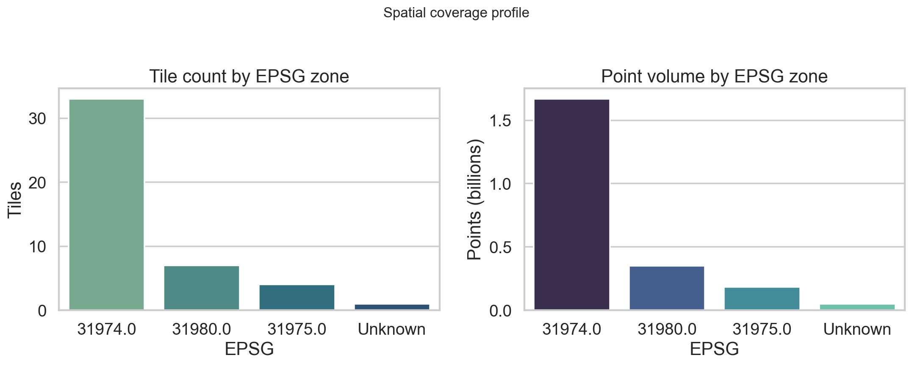
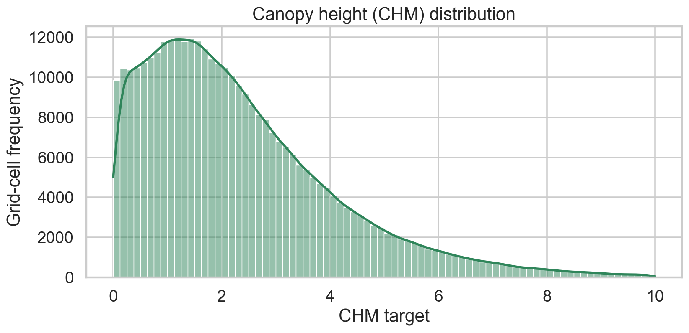
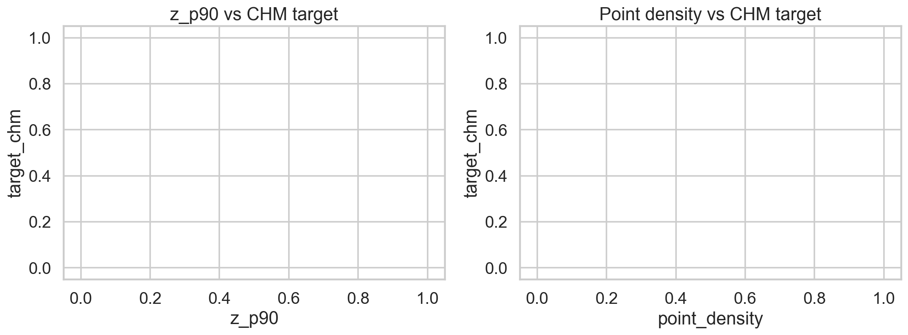
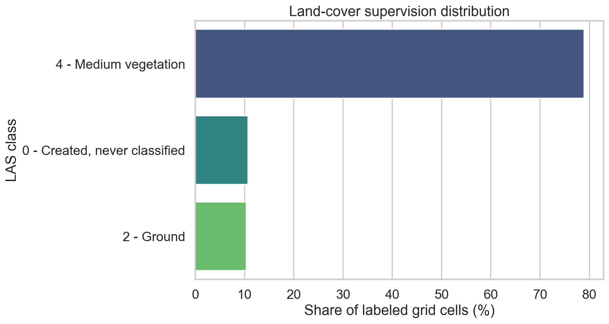
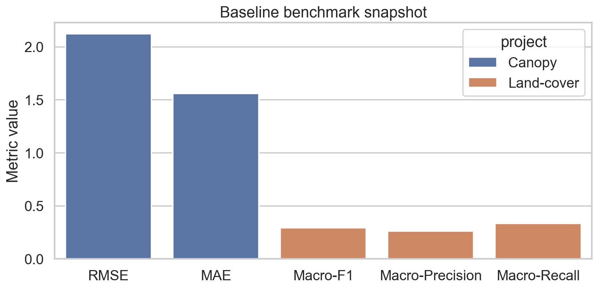

# LIDAR RORAIMA

Portfolio-grade LiDAR ML repository built from the Kaggle dataset:
`rogriofmeireles/lidar-roraima-parime-research`

This repo contains two subprojects built on a shared geospatial pipeline:

1. Canopy height prediction (CHM regression)
2. Land-cover prediction (LAS class supervision)

## What this data is

This dataset contains airborne LiDAR tiles (`.laz`) over the Roraima Parima region.
Each point carries 3D geometry and LiDAR attributes (height, intensity, return structure, LAS class).

In this project, points are transformed into **10m grid cells** and used for:

1. **Canopy Height Modeling (CHM regression)** at grid-cell level.
2. **Land-cover prediction** using LAS `classification` labels.

## Current status (March 5, 2026)

- Shared notebooks complete locally: `00`, `01`.
- Canopy track complete locally: `10`, `11`, `12`, `13`.
- Land-cover track complete locally: `20`, `21`, `22`, `23`.
- Showcase notebook complete locally: `90`.
- Kaggle executions validated so far: `00`, `01`, `10`, `11`, `12`.

Notebook publication tracker:
- `docs/notebook_index.md`

## Visual overview

### Spatial coverage and data volume



### Canopy target signal




### Land-cover supervision balance



### Baseline performance snapshot



## Repository layout

- `lidar_data/` raw LAZ tiles (local only)
- `src/lidar_roraima/` reusable package (manifest, features, CV, training, inference, ensemble)
- `scripts/` reproducible CLI entrypoints
- `notebooks/` Kaggle notebook sequence (00 to 90)
- `subprojects/canopy-height/` canopy-focused docs and benchmark context
- `subprojects/land-cover/` land-cover-focused docs and benchmark context
- `benchmarks/` exported model metrics
- `images/` EDA and benchmark figures
- `docs/project_overview.md` concise technical story with visuals
- `docs/notebook_index.md` Kaggle/GitHub publication tracker

## Verified dataset facts

- 45 `.laz` tiles detected (including 1 `.copc.laz` duplicate representation).
- 2,249,752,652 points from LAS headers.
- CRS mix detected across EPSG `31974`, `31975`, `31980`.
- Duplicate tile handling and CRS-aware partitioning enforced in pipeline.

## What we built

1. **Manifest + QA layer**
   - Header/VLR audit, CRS detection, duplicate detection, and per-tile quality flags.
2. **Shared feature pipeline**
   - Gridded LiDAR features (`height percentiles`, `intensity`, `return ratios`, `roughness`, `density`).
3. **Two model tracks**
   - Canopy regression notebooks (`10` to `13`).
   - Land-cover classification notebooks (`20` to `23`).
4. **Inference showcase**
   - Final notebook `90` for end-to-end predictions and portfolio delivery.

## Baseline benchmark snapshot

- Canopy baseline:
  - RMSE `2.1238`
  - MAE `1.5596`
  - R2 `-0.0421`
- Land-cover baseline:
  - Macro-F1 `0.2934`
  - Macro-Precision `0.2628`
  - Macro-Recall `0.3333`

Metric sources:
- `benchmarks/canopy/metrics.csv`
- `benchmarks/landcover/metrics.csv`

## Results table

| Track | Model | RMSE | MAE | R2 | Macro-F1 | Macro-Precision | Macro-Recall | Status |
|---|---|---:|---:|---:|---:|---:|---:|---|
| Canopy | Baseline | 2.1238 | 1.5596 | -0.0421 | - | - | - | Complete |
| Canopy | Random Forest | TBD | TBD | TBD | - | - | - | Pending benchmark sync |
| Canopy | Boosting | TBD | TBD | TBD | - | - | - | Pending benchmark sync |
| Canopy | Ensemble | TBD | TBD | TBD | - | - | - | Pending benchmark sync |
| Land-cover | Baseline | - | - | - | 0.2934 | 0.2628 | 0.3333 | Complete |
| Land-cover | Random Forest | - | - | - | TBD | TBD | TBD | Pending benchmark sync |
| Land-cover | Boosting | - | - | - | TBD | TBD | TBD | Pending benchmark sync |
| Land-cover | Ensemble | - | - | - | TBD | TBD | TBD | Pending benchmark sync |

## Why this repo is portfolio-focused

- End-to-end reproducibility from raw LiDAR to model artifacts.
- Explicit handling of geospatial pitfalls (mixed CRS zones, duplicate tiles, spatial leakage).
- Clear notebook progression and publication index for external review.
- Visual outputs designed for fast skimming by recruiters and collaborators.

## Quickstart (Windows, Python 3.11)

```powershell
py -3.11 -m pip install -r requirements.txt
py -3.11 scripts/build_manifest.py --root .
py -3.11 scripts/build_features.py --root . --cell-size 10 --chunk-size 1000000
py -3.11 scripts/train_model.py --project canopy --family baseline
py -3.11 scripts/train_model.py --project landcover --family baseline
```

## Heavy Training Policy

Run heavy model training on remote runtimes only.

- Kaggle / Colab full run:
```powershell
py -3.11 scripts/train_all.py --profile kaggle_full
```
- Local smoke test only:
```powershell
py -3.11 scripts/train_all.py --profile local_smoke
```

Profiles are defined in:
- `src/lidar_roraima/runtime.py`

## Notebook sequence

1. `00_metadata_eda.ipynb`
2. `01_feature_engineering_shared.ipynb`
3. `10_canopy_baseline.ipynb`
4. `11_canopy_random_forest.ipynb`
5. `12_canopy_boosting.ipynb`
6. `13_canopy_ensemble.ipynb`
7. `20_landcover_baseline.ipynb`
8. `21_landcover_random_forest.ipynb`
9. `22_landcover_boosting.ipynb`
10. `23_landcover_ensemble.ipynb`
11. `90_portfolio_inference_showcase.ipynb`

## Data contracts

- `tile_manifest.parquet`: tile metadata, CRS, QA flags, duplicates
- `features_{zone}_{cellsize}m.parquet`: grid features + optional targets
- `model_results.csv`: benchmark registry
- inference outputs: grid predictions + uncertainty + model version

## Kaggle runtime hardening

Notebooks now detect:
- local repo paths
- `/kaggle/input/lidar-roraima-parime-research[/lidar_data]` dataset mounts

This keeps one notebook codebase usable both locally and on Kaggle.

## Kaggle automation (batch)

Use these scripts to avoid manual one-by-one notebook uploads:

```powershell
py -3.11 scripts/kaggle_bulk_push.py --username <your-kaggle-username>
py -3.11 scripts/kaggle_bulk_status.py --username <your-kaggle-username>
py -3.11 scripts/kaggle_bulk_output.py --username <your-kaggle-username>
```

Prerequisite: Kaggle API token at `%USERPROFILE%\.kaggle\kaggle.json`.
